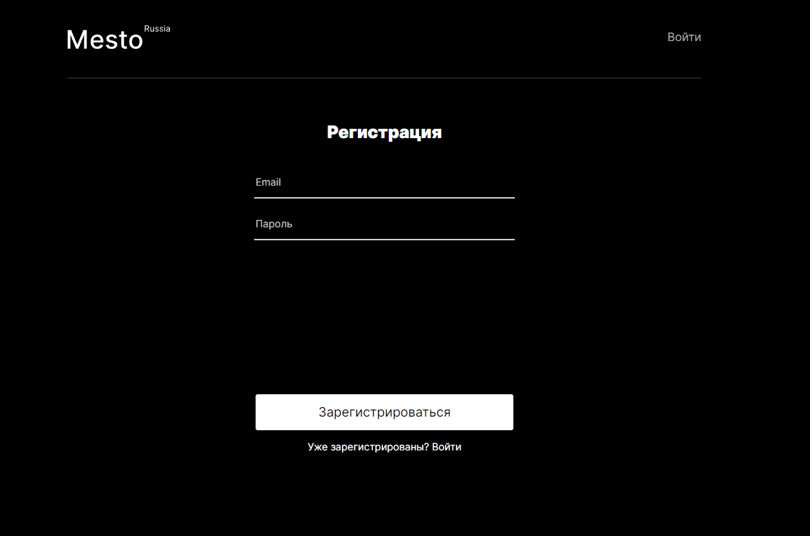
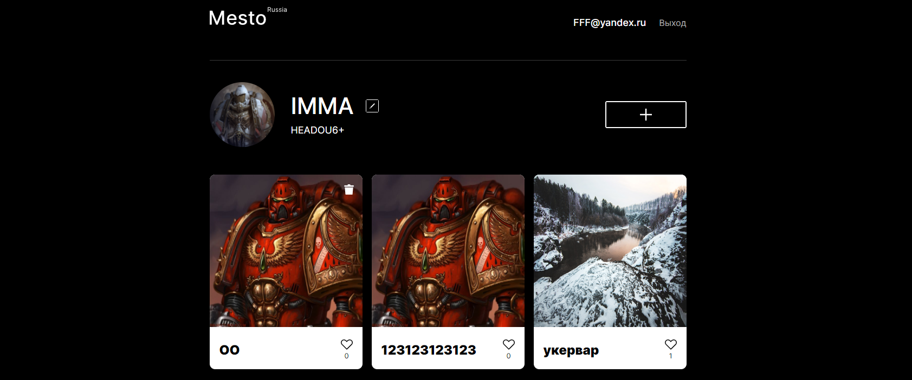
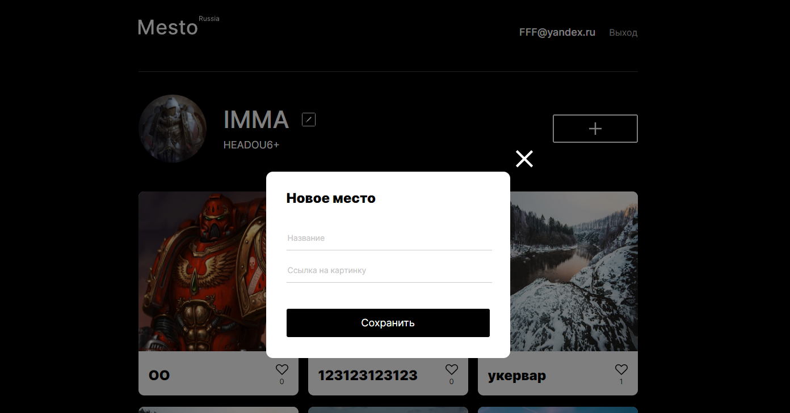

# REACT-MESTO-API-FULL

ДЕМО: https://ave-emperror.nomoredomains.work/main
(скоро кончается грант на облако, может перестать работать)

## Функциональность

Сайт с карточками путешествий. Аутентификация/авторизация. 
Запросы к api. Возможность добавления\удаления карточек. 
Возможность простановки лайков. 
Валидация форм(попапов) 
Адаптивная верстка 
Полноценный api 

### Страница регистрации

### Страница с логирования

### Страница с карточками

### Попапы (создание новой карточки, редактирование аватарки, редактирование профиля соответственно):

 
 
 

### Стек:

- HTML
- CSS
- JavaScript
- React
- express.js

### Запуск проекта

Для запуска проекта:

1. Клонировать репозиторий git clone https://github.com/Firebird234/react-mesto-api-full/tree/main/react-mesto-auth.
2. Перейти в одну из директорий: express-mesto() react-mesto-auth()
3. Установить все зависимости в текущей директории git install.
4. Запустить проект:
   react-mesto-auth => npm start.
   express-mesto => (mongod, npm run dev)

ссылки(продолжат работать пока не кончится грант на Я.Облаке):
Front [https://wazzuuuuup.nomoredomains.work]
Api [https://api.wazzuuuuup.nomoredomains.work]
